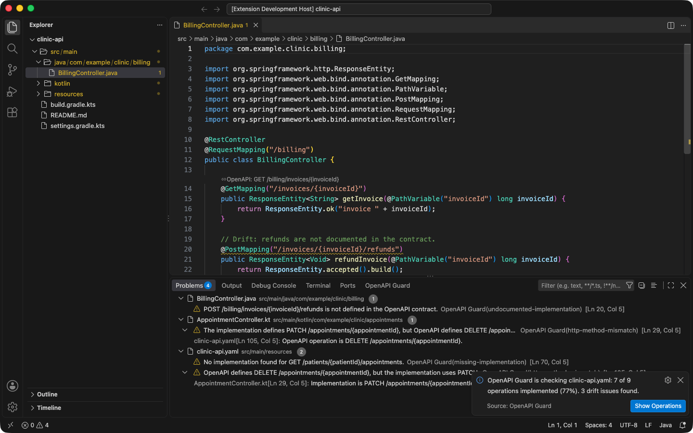
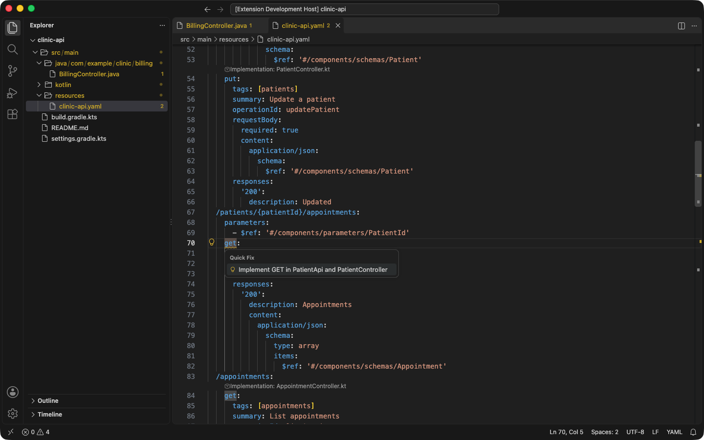
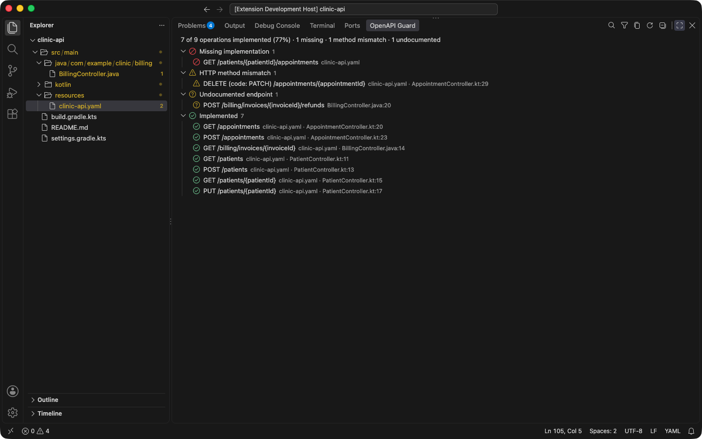
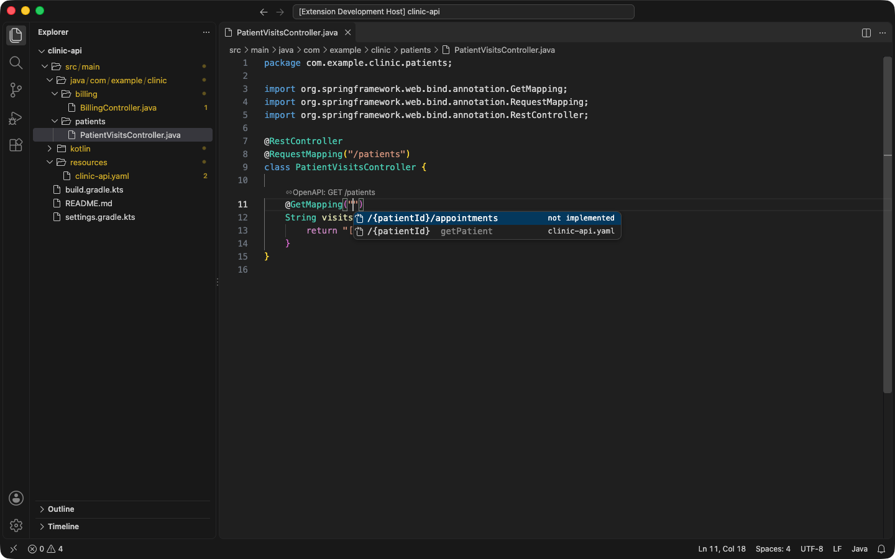
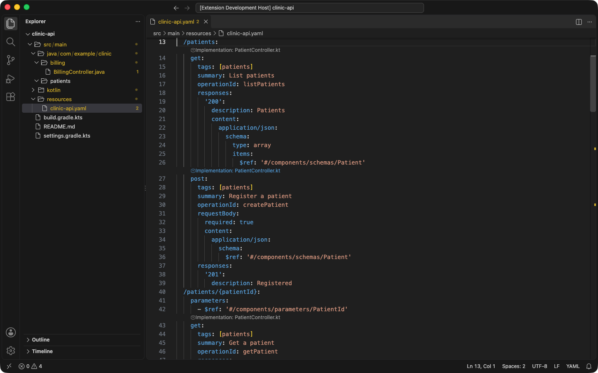

# OpenAPI Guard for VS Code

> **Status: released.** Install [OpenAPI Guard](https://marketplace.visualstudio.com/items?itemName=StackBlender.openapi-guard) from Visual Studio Marketplace.

OpenAPI Guard for VS Code compares OpenAPI 3.x operations with Spring Boot
Java/Kotlin and NestJS TypeScript endpoints. It reports missing implementations,
undocumented endpoints, and HTTP method mismatches, helps you fix them, and shows
every operation's status at a glance. Analysis runs locally; nothing is uploaded.

After the first analysis, OpenAPI Guard summarizes coverage and lists drift in the
Problems panel.

## What it does

- **Finds your contracts by content**: any OpenAPI 3.x YAML or JSON file, whatever
  its name; several at once, each scoped to the build module it describes.
- **Understands real Spring projects**: mappings inherited from interfaces and base
  classes (including openapi-generator interface-only and delegate projects),
  constant paths, `${...}` placeholders from `application.properties` /
  `application.yml`, and OpenAPI `servers` base paths aligned with the servlet
  context path. NestJS controllers are supported too.
- **Reports drift on both sides** as diagnostics, with per-rule severity and
  suppression.
- **Fixes drift in one step** with quick fixes (Ctrl/Cmd+.): add an undocumented
  endpoint to a YAML specification, implement a missing operation (following your
  API-interface pattern), or align a mismatched HTTP method on either side.

  

- **Shows the whole contract** in the **Operations** view of the OpenAPI Guard
  panel: every operation's status under a coverage summary, with a filter, a
  problems-only toggle, navigation, and **Copy as Markdown** for pull requests.

  

- **Completes contract paths** inside Spring mapping annotations, with operations
  that have no implementation yet listed first.

  

- **Navigates both ways** with CodeLens links, commands, and standard Go to
  Definition (F12, Ctrl/Cmd+click, Peek Definition).

  

The extension also bundles a local [CLI](../cli/README.md), VS Code agent tool,
and [MCP adapter](../mcp/README.md).

The extension identifier is `StackBlender.openapi-guard`. The current package
targets desktop VS Code 1.96.0 and later.

## Documentation

- [Installation](installation.md)
- [Configuration and behavior](configuration.md)
- [Troubleshooting](troubleshooting.md)
- [Release status](../release-status.md)
- [Privacy](../privacy.md)

The commands and settings in these pages were verified for version 0.3.2.
