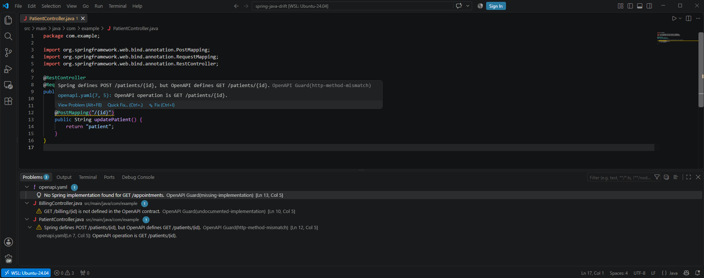
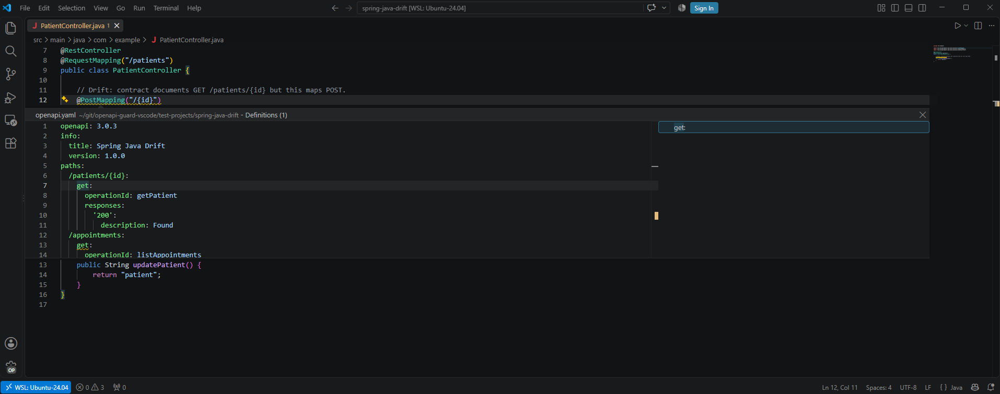

# OpenAPI Guard for VS Code

> **Status: released.** Install [OpenAPI Guard by StackBlender](https://marketplace.visualstudio.com/items?itemName=StackBlender.openapi-guard) from Visual Studio Marketplace.

OpenAPI Guard for VS Code compares OpenAPI 3.x operations with Spring Boot Java and Kotlin endpoints. Current Free analysis reports missing implementations, undocumented Spring endpoints, and HTTP method mismatches for matching routes.

Analysis runs automatically in the local workspace. Results appear as diagnostics and support navigation between related OpenAPI operations and Spring handlers. The extension also bundles a local [CLI](../cli/README.md), VS Code agent tool, and [MCP adapter](../mcp/README.md).

The screenshot shows the current Free analyzer reporting a method mismatch, a missing Spring implementation, and an undocumented Spring endpoint.

OpenAPI Guard participates in VS Code's standard definition workflow, including F12, Ctrl/Cmd+click, and Peek Definition.

The extension identifier is `StackBlender.openapi-guard`. The current package targets desktop VS Code 1.96.0 and later.

## Documentation

- [Installation](installation.md)
- [Configuration and behavior](configuration.md)
- [Troubleshooting](troubleshooting.md)
- [Release status](../release-status.md)
- [Privacy](../privacy.md)

The commands and settings in these pages were verified for version 0.1.0. Deeper contract checks described as planned in the [release status](../release-status.md) are not currently available.
